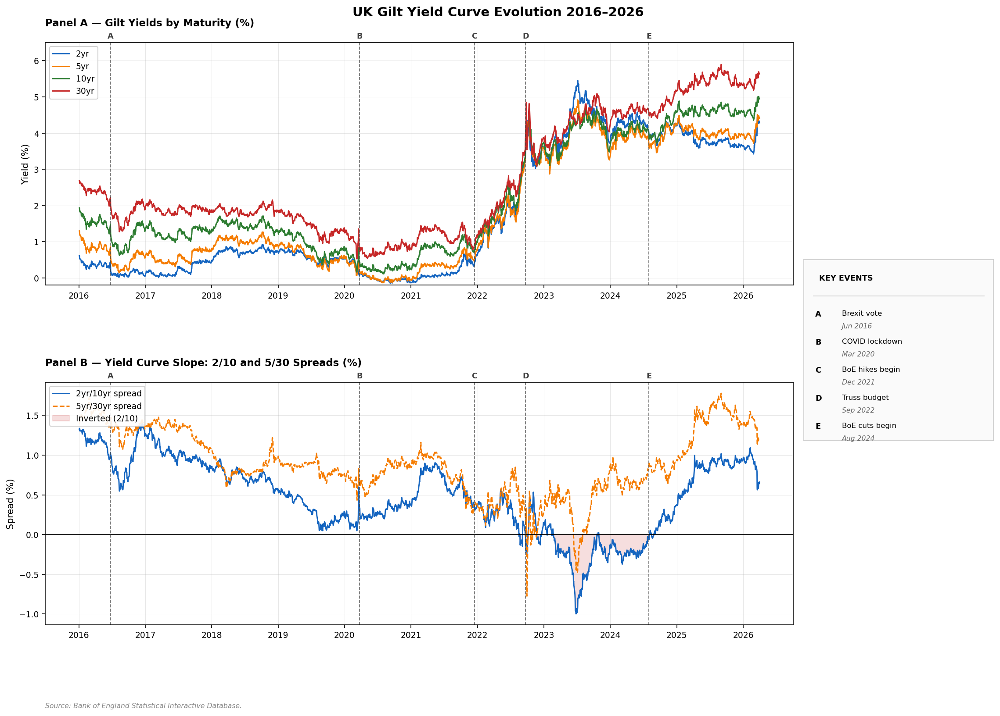
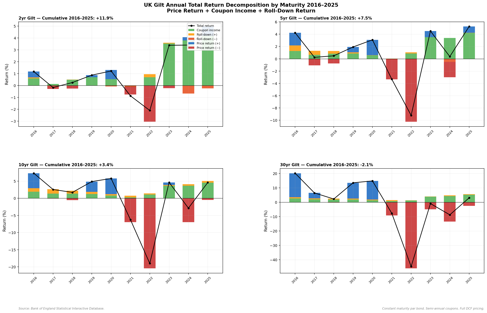
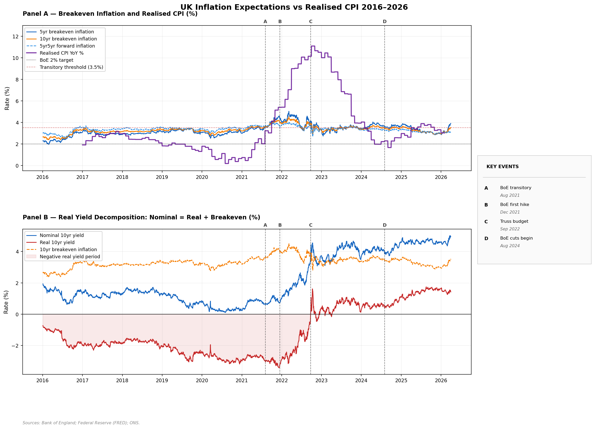
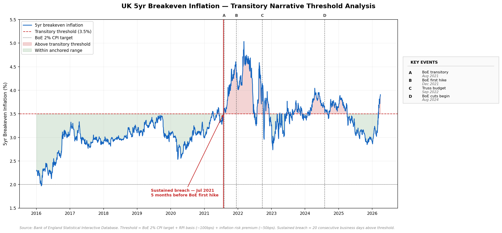
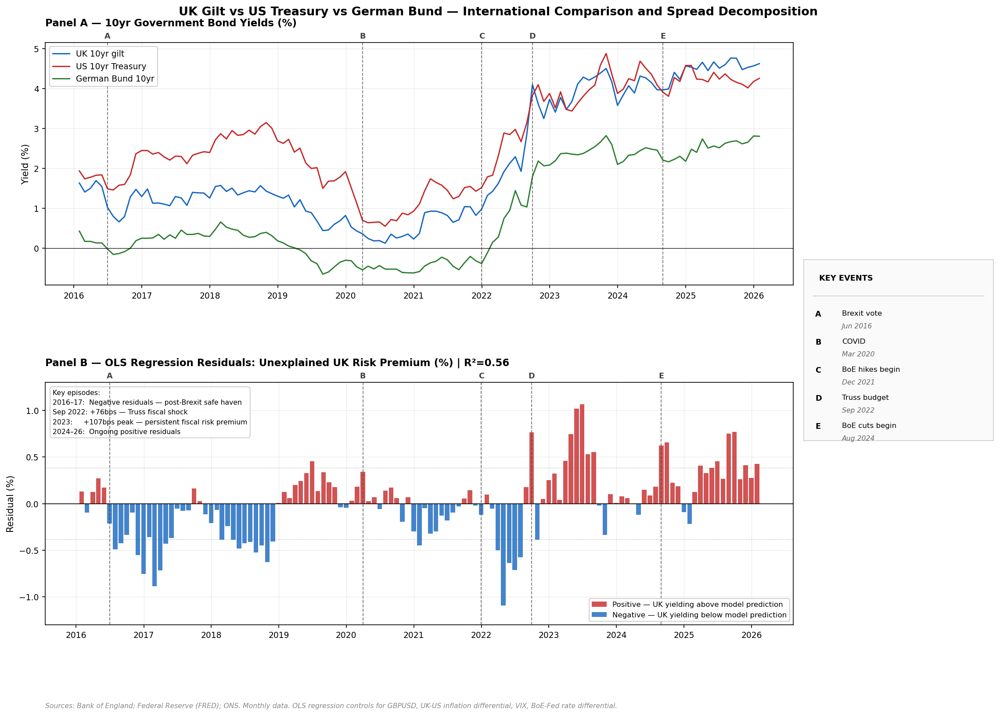
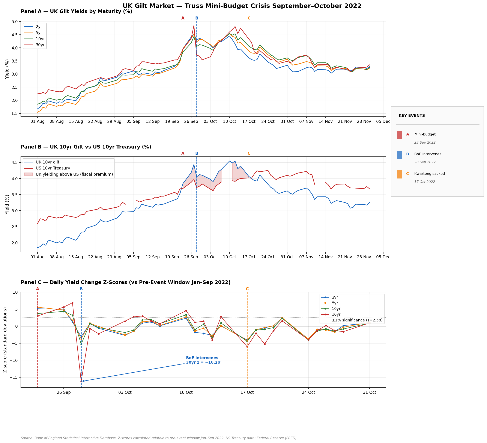
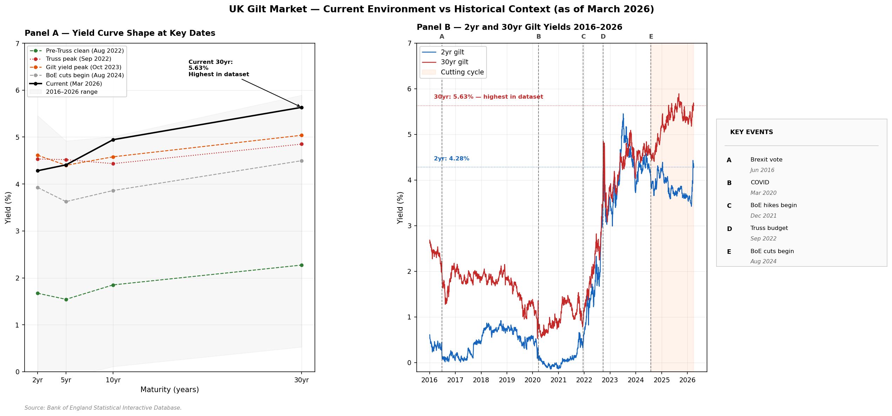

# UK Gilt Market Dynamics Through the Inflation Cycle 2016–2026

**Independent research project - Thomas Sumner, March - April 2026**

---

## Overview

This project analyses UK gilt market dynamics from 2016 to 2026 using daily data from the Bank of England, ONS, and FRED. It constructs the UK gilt yield curve, decomposes yields into real and inflation components, runs an OLS regression decomposing the gilt-Treasury spread against macroeconomic drivers, and conducts an event study of the September 2022 Truss mini-budget crisis.

---

## Key Findings

**1. Markets rejected the transitory narrative in July 2021 - five months before the BoE acted**

Using a 3.5% threshold on the 5yr breakeven inflation rate (BoE 2% CPI target + RPI basis + inflation risk premium), the first sustained breach occurred in July 2021. Bank Rate was 0.05% and realised CPI was 3.22%. The gilt market stopped believing inflation was transitory before the BoE acknowledged it.

**2. The gilt sell-off had two analytically distinct phases**
- *2021:* Inflation expectations drove nominal yields higher - real yields barely moved. An inflation expectations story. Index-linked gilts offered protection.
- *2022:* Real yields surged 284bps as the hiking cycle delivered genuine real tightening. Both nominal and index-linked gilts fell - no hiding place in duration.

**3. Long duration destroyed value over the decade**

Annual total return decomposition (full DCF pricing, constant maturity par bond) across 2016–2025:

| Maturity | Cumulative Return 2016–2025 |
|---|---|
| 2yr | +11.87% |
| 5yr | +7.52% |
| 10yr | +3.38% |
| 30yr | **−2.06%** |

The 2022 inflation shock completely reversed the conventional case for long duration outperformance over long holding periods.

**4. OLS regression identifies a persistent UK fiscal risk premium**

Regressing the gilt-Treasury spread against GBPUSD, UK-US inflation differential, VIX, and BoE-Fed rate differential (R²=0.56), the residuals reveal:
- Post-Brexit 2016–17: negative residuals - UK gilts a safe haven, yielding below fundamentals
- Truss episode Sep 2022: +76bps unexplained - pure fiscal credibility shock
- Mid-2023: +107bps peak - persistent fiscal risk premium larger than the Truss spike itself
- Current (2024–26): ongoing positive residuals - fiscal premium not fully unwound

**5. The Truss intervention: −16.2 standard deviations**

Event study using z-scores relative to a pre-event window (Jan–Sep 2022). The BoE intervention on 28 September 2022 produced a 112.8bp fall in the 30yr gilt yield in a single day - a z-score of −16.2σ, the most statistically extreme event in the full dataset. Under normally distributed returns, the probability of a move this large is effectively zero.

**6. Current 30yr gilt yield is the highest in the dataset**

As of March 2026, the 30yr gilt yields 5.63% — above both the Truss peak (4.85%) and the October 2023 cycle peak (5.04%). The BoE is cutting rates yet long-end yields are rising. The fiscal risk premium and incomplete inflation re-anchoring (10yr breakeven 3.53%) are overwhelming monetary policy signals at the long end.

---

## Project Structure

| Notebook | Content |
|---|---|
| 01_data_collection | All data pulls — BoE, FRED, yfinance. Clean and save |
| 02_yield_curve | Yield curve construction, slope measures, total return decomposition |
| 03_inflation_expectations | Breakeven inflation, real yield decomposition, transitory narrative |
| 04_international_comparison | UK vs US vs Germany, OLS regression, spread decomposition |
| 05_truss_case_study | Event study, LDI portfolio simulation, BoE intervention |
| 06_current_environment | Current snapshot, fiscal comparison, portfolio scenario analysis |
| 07_visualisations | Publication quality charts |

**Folder structure:**
- `/data/raw` — source files, not committed to GitHub
- `/data/processed` — cleaned CSVs, not committed to GitHub
- `/outputs/charts` — all publication charts
- `/diary` — project diary entries

---

## Charts

**UK Gilt Yield Curve Evolution 2016–2026**

**Annual Total Return Decomposition by Maturity**

**Breakeven Inflation vs Realised CPI**

**Transitory Narrative Threshold Analysis**

**International Comparison and OLS Regression Residuals**

**Truss Mini-Budget Event Study**

**Current Environment vs Historical Context**

---

## Data Sources

| Source | Data | Series |
|---|---|---|
| Bank of England | UK nominal gilt spot curve (2yr, 5yr, 10yr, 30yr) | BoE Statistical Interactive Database |
| Bank of England | UK real gilt spot curve (5yr, 10yr, 30yr) | BoE Statistical Interactive Database |
| Bank of England | UK inflation curve (5yr, 10yr, 30yr) | BoE Statistical Interactive Database |
| ONS | UK CPI — series D7BT | MM23 |
| FRED | US Treasury yields | DGS2, DGS5, DGS10, DGS30 |
| FRED | US TIPS real yields and breakevens | DFII5, DFII10, T10YIE |
| FRED | German Bund 10yr | IRLTLT01DEM156N |
| FRED | Policy rates — Fed Funds, ECB | FEDFUNDS, ECBDFR |
| FRED | Macro variables — VIX, GBPUSD | VIXCLS, DEXUSUK |

All data sourced via free public APIs and official government statistical releases. No Bloomberg or paid data terminal used.

---

## Methodology Notes

- **Spot curves over redemption yields** - BoE modelled zero coupon spot curves used throughout - coupon-independent and maturity-specific.
- **Total return decomposition** - full DCF pricing formula (not duration approximation), constant maturity par bond, semi-annual coupon convention. Captures convexity - material for large yield moves
- **Breakeven inflation** - derived from BoE nominal minus real spot curves. RPI basis (~100bps above CPI) means figures overstate CPI-equivalent expectations. No independent cross-check available - UK inflation swap data not freely accessible
- **OLS regression** - monthly frequency, levels specification. Stationarity not formally tested - results interpreted as descriptive. Low R² on yield-policy betas (0.03–0.07) confirms term premium dominates monetary policy in explaining gilt yield variation
- **Event study** - z-scores relative to Jan–Sep 2022 pre-event window. Assumes approximately normally distributed daily yield changes - fat tails in practice mean true rarity of extreme moves is even greater than z-scores imply
- **LDI simulation** - stylised illustrative example. Real LDI structures varied in leverage, instrument type, and margin mechanics. Purpose is to illustrate the liquidity crisis mechanics numerically

---